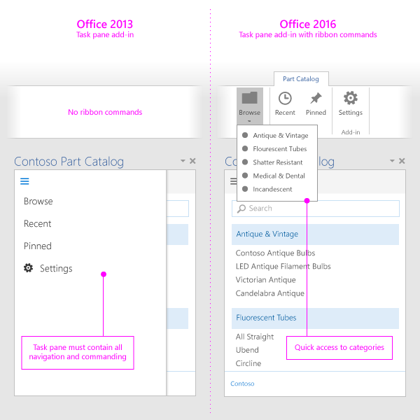

# Add-in commands for Excel, Word, and PowerPoint

Add-in commands are UI elements that extend the Office UI and start actions in your add-in. You can use add-in commands to add a button on the ribbon or an item to a context menu. When users select an add-in command, they initiate actions such as running JavaScript code, or showing a page of the add-in in a task pane. Add-in commands help users find and use your add-in, which can help increase your add-in's adoption and reuse, and improve customer retention.

For an overview of the feature, see the video [Add-in Commands in the Office Ribbon](https://channel9.msdn.com/events/Build/2016/P551).

> [!NOTE]
> SharePoint catalogs do not support add-in commands. You can deploy add-in commands via [Centralized Deployment](../publish/centralized-deployment.md) or the [Office Store](https://dev.office.com/officestore/docs/submit-to-the-office-store), or use [sideloading](../testing/create-a-network-shared-folder-catalog-for-task-pane-and-content-add-ins.md) to deploy your add-in command for testing. 

*Figure 1. Add-in with commands running in Excel Desktop*

*Figure 2. Add-in with commands running in Excel Online*

## Command capabilities
The following command capabilities are currently supported.

> [!NOTE]
> Content add-ins do not currently support add-in commands.

**Extension points**

- Ribbon tabs - Extend built-in tabs or create a new custom tab.
- Context menus - Extend selected context menus. 

**Control types**

- Simple buttons - trigger specific actions.
- Menus - simple menu dropdown with buttons that trigger actions.

**Actions**

- ShowTaskpane - Displays one or multiple panes that load custom HTML pages inside them.
- ExecuteFunction - Loads an invisible HTML page and then execute a JavaScript function within it. To show UI within your function (such as errors, progress, or additional input) you can use the [displayDialog](http://dev.office.com/reference/add-ins/shared/officeui) API.  

## Supported platforms
Add-in commands are currently supported on the following platforms:

- Office for Windows Desktop 2016 (build 16.0.6769+)
- Office for Mac (build 15.33+)
- Office Online 

More platforms are coming soon.

## Best practices

Apply the following best practices when you develop add-in commands:

- Use commands to represent a specific action with a clear and specific outcome for users. Do not combine multiple actions in a single button.
- Provide granular actions that make common tasks within your add-in more efficient to perform. Minimize the number of steps an action takes to complete.
- For the placement of your commands in the Office ribbon:
	- Place commands on an existing tab (Insert, Review, and so on) if the functionality provided fits there. For example, if your add-in enables users to insert media, add a group to the Insert tab. Note that not all tabs are available across all Office versions. For more information, see [Office Add-ins XML manifest](../overview/add-in-manifests.md). 
	- Place commands on the Home tab if the functionality doesn't fit on another tab, and you have fewer than six top-level commands. You can also add commands to the Home tab if your add-in needs to work across Office versions (such as Office Desktop and Office Online) and a tab is not available in all versions (for example, the Design tab doesn't exist in Office Online).  
	- Place commands on a custom tab if you have more than six top-level commands. 
    - Name your group to match the name of your add-in. If you have multiple groups, name each group based on the functionality that the commands in that group provide.
    - Do not add superfluous buttons to increase the real estate of your add-in.

     > [!NOTE]
     > Add-ins that take up too much space might not pass [Office Store validation](https://dev.office.com/officestore/docs/validation-policies).

- For all icons, follow the [icon design guidelines](design-icons.md).
- Provide a version of your add-in that also works on hosts that do not support commands. A single add-in manifest can work in both command-aware (with commands) and non-command-aware (as a taskpane) hosts.

   *Figure 3. Task pane add-in in Office 2013 and the same add-in using add-in commands in Office 2016*

   

## Next steps

The best way to get started using add-in commands is to take a look at the [Office Add-in commands samples](https://github.com/OfficeDev/Office-Add-in-Commands-Samples/) on GitHub.

For more information about specifying add-in commands in your manifest, see [Define add-in commands in your manifest](../develop/define-add-in-commands.md) and the [VersionOverrides](https://dev.office.com/reference/add-ins/manifest/versionoverrides) reference content.

