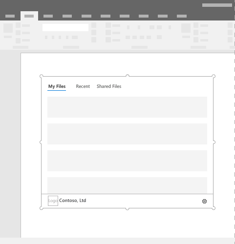

# Content Office Add-ins

Content add-ins are surfaces that can be embedded directly into Word, Excel, or PowerPoint documents. Content add-ins give users access to interface controls that run code to modify documents or display data from a data source. Use content add-ins when you want to embed functionality directly into the document.  

*Figure 1. Typical layout for content add-ins*

## Best practices

- Include some navigational or commanding element such as the CommandBar or Pivot at the top of your add-in.
- Include a branding element such as the BrandBar at the bottom of your add-in (applies to Word, Excel, and PowerPoint add-ins only).

## Variants

Content add-in sizes for Word, Excel, and PowerPoint in Office 2016 desktop and Office 365 are user specified.

## Personality menu

Personality menus can obstruct navigational and commanding elements located near the top right of the add-in. The following are the current dimensions of the personality menu on Windows and Mac.

For Windows, the personality menu measures 12x32 pixels, as shown.

*Figure 2. Personality menu on Windows* 

For Mac, the personality menu measures 26x26 pixels, but floats 8 pixels in from the right and 6 pixels from the top, which increases the occupied space to 34x32 pixels, as shown.

*Figure 3. Personality menu on Mac*

## Implementation

For a sample that implements a content add-in, see [Excel Content Add-in Humongous Insurance](https://github.com/OfficeDev/Excel-Content-Add-in-Humongous-Insurance) in GitHub.

## Support considerations
- Check to see if your Office Add-in will work on a [specific Office host platform]9/overview/office-add-in-availability.md). 
- Some add-ins may require the user to "trust" the add-in to read and write to Excel or PowerPoint. You can declare what [level of permissions](/develop/requesting-permissions-for-api-use-in-content-and-task-pane-add-ins.md) you want your use to have in the add-in's manifest.  
- Content add-ins are supported in Excel and PowerPoint in Office 2013 version and later. If you open an add-in in a version of Office that doesn't support Office web add-ins, the add-in will be displayed as an image.

## See also
- [Office Add-in host and platform availability](/overview/office-add-in-availability.md)
- [Office UI Fabric in Office Add-ins](office-ui-fabric.md) 
- [UX design patterns for Office Add-ins](ux-design-patterns.md)
- [Requesting permissions for API use in content and task pane add-ins](/develop/requesting-permissions-for-api-use-in-content-and-task-pane-add-ins.md)
