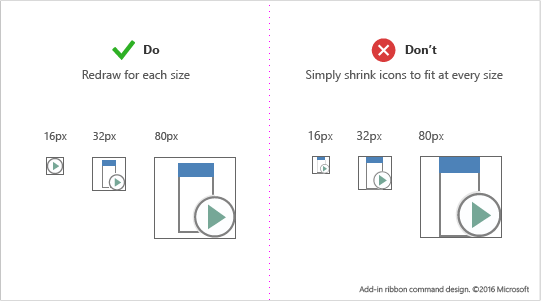
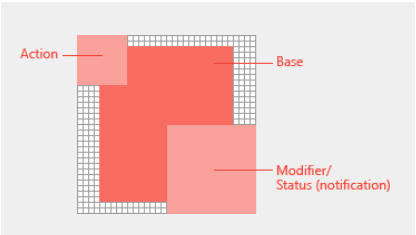

# Design icons for add-in commands

[Add-in commands](add-in-commands.md) add buttons, text, and icons to the Office UI. Your add-in command buttons should provide meaningful icons and labels that clearly identify the action the user is taking when they use a command. This article provides stylistic and production guidelines that help you design icons that integrate seamlessly with Office. 

## Office icon design principles

The Office 2013 release of the Office desktop clients includes refreshed iconography. The overriding stylistic change is reduction. The new icons include only essential communicative elements. Non-essential elements including perspective, gradients, and light source are removed. The simplified icons support faster parsing of commands and controls. Follow this style to best fit with Office.

Office icons are based on the following design principles: 

- Modern interpretation of Office icon collection 
- Fresh yet familiar  
- Simple, clear, and direct 

The following image shows icons that apply the modern design principles.

## Icon guidelines
Follow these guidelines when you create your icons: 

- Stick to the 1px grid and use a bitmap editing tool for best results.  
- Redraw, don't resize. As you resize your icons for larger or smaller sizes, take the time to redraw cutouts, corners, and rounded edges to maximize line clarity. 
- Remove artifacts that make your icon look messy.
- Don't reuse Office UI Fabric icons in the Office ribbon or contextual menu. Fabric icons are stylistically different and will not match. 
- Avoid relying on your logo or brand to communicate what an add-in command does. Brand marks aren't always recognizable at smaller icon sizes and when modifiers are applied. Brand marks often conflict with Office ribbon icon styles, and can compete for user attention in a saturated environment.
- Use a white fill for accessibility. Most objects in your icons will require a white background to be legible across Office UI themes and in high-contrast modes.  
- Use the PNG format with a transparent background. 
- Avoid localizable content in your icons, including typographic characters, indications of paragraph rags, and question marks. 
- Don't reuse visual metaphors for different commands. Using the same icon for different actions can cause confusion. 
- Make your button labels clear and succinct. Use a combination of visual and textual information to convey meaning. 

## Icon size recommendations and requirements

Office 2016 desktop icons are bitmap images. Different sizes will render depending on the user's DPI setting and touch mode. Include all eight supported sizes to create the best experience in all supported resolutions and contexts. The following are the supported sizes - three are required:

- 16 px (Required)
- 20 px
- 24 px
- 32 px (Required)
- 40 px
- 48 px
- 64 px (Recommended, best for Mac)
- 80 px (Required)  

Make sure to redraw your icons for each size rather than shrink them to fit.

<!--
The following table shows the icon sizes that render for different modes at different DPI settings.

|DPI |**Small**||**Medium**||**Large**||**Extra large**|
|:---|:---|:---|:---|:---|:---|:---|:---|
|    |**Mouse**|**Touch**|**Mouse**|**Touch**|**Mouse**|**Touch**|-|
|100%|16px|20px|24px||32px|40px|48px|
|125%|20px|24px|||40px|48px|60px|
|150%|24px|24px|36px||48px|48px|72px|
|200%|32px|40px|48px||64px|80px|96px|
|250%|40px||||80px||120px|
|300%|48px||||96px||144px

>**Note:** At DPI settings of 150% or greater, the icon does not get swapped out for a larger size when Touch mode is engaged. At DPI settings greater than 250%, Touch mode is turned off by default.

The following table lists the locations for certain icon sizes.

|Location|100% DPI|200% DPI|250% DPI|
|:-------|:-------|:-------|:-------|
|Small ribbon button|16px|32px|40px|
|Contextual menu|16px|32px|40px|
|Quick access toolbar (QAT)|16px|32px|40px|
|Large ribbon icon|32px|64px|80px|

-->

## Icon anatomy and layout

Office icons are typically comprised of a base element with action and conceptual modifiers overlayed. Action modifiers represent concepts such as add, open, new, or close. Conceptual modifiers represent status, alteration, or a description of the icon. 

To create commands that align with the Office UI, follow layout guidelines for the base element and modifiers. This ensures that your commands look professional and that your customers will trust your add-in. If you make exceptions to these guidelines, do so intentionally.

The following image shows the layout of base elements and modifiers in an Office icon.

- Center base elements in the pixel frame with empty padding all around.
- Place action modifiers on the top left. 
- Place conceptual modifiers on the bottom right.
- Limit the number of elements in your icons. At 32px, limit the number of modifiers to a maximum of two. At 16px, limit the number of modifiers to one.

Place base elements consistently across sizes. If base elements can't be centered in the frame, align them to the top left, leaving the extra pixels on the bottom right. For best results, apply the padding guidelines listed in the following table.

|**Icon size**|**Padding around base element**|
|:---|:---|
|16px|0|
|20px|1px|
|24px|1px|
|32px|2px|
|40px|2px|
|48px|3px|
|64px|5px|
|80px|5px|

All modifiers should have a 1px transparent cutout between each element, including the background. Elements should not directly overlap. Create whitespace between rules and edges. Modifiers can vary slightly in size, but use these dimensions as a starting point.

|**Icon size**|**Modifier size**|
|:---|:---|
|16px|9px|
|20px|10px|
|24px|12px|
|32px|14px|
|40px|20px|
|48px|22px|
|64px|29px|
|80px|38px|

## Icon colors

Office icons have a limited color palette. Use the colors listed in the following table to guarantee seamless integration with the Office UI. Apply the following guidelines to the use of color: 

- Use color to communicate meaning rather than for embellishment. It should highlight or emphasize an action, status, or an element that explicitly differentiates the mark.  
- If possible, use only one additional color beyond gray. Limit additional colors to two at the most.
- Colors should have a consistent appearance in all icon sizes. Office icons have slightly different color palettes for different icon sizes. 16px and smaller icons are slightly darker and more vibrant than 32px and larger icons. Without these subtle adjustments, colors appear to vary across sizes.   

|**Color name**|**RGB**|**Hex**|**Color**|**Category**|
|:---|:---|:---|:---|:---|
|Text Gray (80)|80, 80, 80|#505050|  |Text|
|Text Gray (95)|95, 95, 95|#5F5F5F|  |Text|
|Text Gray (105)|105, 105, 105|#696969|  |Text|
|Dark Gray 32|128, 128, 128|#808080|  |32 and above|
|Medium Gray 32|158, 158, 158|#9E9E9E|  |32 and above|
|Light Gray ALL|179, 179, 179|#B3B3B3|  |All sizes|
|Dark Gray 16|114, 114, 114|#727272|  |16 and below|
|Medium Gray 16|144, 144, 144|#909090|  |16 and below|
|Blue 32|77, 130, 184|#4d82B8|  |32 and above|
|Blue 16|74, 125, 177|#4A7DB1|  |16 and below|
|Yellow ALL|234, 194, 130|#EAC282|  |All sizes|
|Orange 32|231, 142, 70|#E78E46|  |32 and above|
|Orange 16|227, 142, 70|#E3751C|  |16 and below|
|Pink ALL|230, 132, 151|#E68497|  |All sizes|
|Green 32|118, 167, 151|#76A797|  |32 and above|
|Green 16|104, 164, 144|#68A490|  |16 and below|
|Red 32|216, 99, 68|#D86344|  |32 and above|
|Red 16|214, 85, 50|#D65532|  |16 and below|
|Purple 32|152, 104, 185|#9868B9|  |32 and above|
|Purple 16|137, 89, 171|#8959AB|  |16 and below|

## Icons in high contrast modes

Office icons are designed to render well in high contrast modes. Foreground elements are well differentiated from backgrounds to maximize legibility and enable recoloring. In high contrast modes, Office will recolor any pixel of your icon with a red, green, or blue value less than 190 to full black. All other pixels will be white. In other words, each RGB channel is assessed where 0-189 values are black and 190-255 values are white. Other high-contrast themes recolor using the same 190 value threshold but with different rules. For example, the high-contrast white theme will recolor all pixels greater than 190 opaque but all other pixels as transparent. Apply the following guidelines to maximize legibility in high-contrast settings:

- Aim to differentiate foreground and background elements along the 190 value threshold.
- Follow Office icon visual styles.
- Use colors from our icon palette.
- Avoid the use of gradients.
- Avoid large blocks of color with similar values.

## Additional resources

- [Add-in development best practices](../overview/add-in-development-best-practices.md)
- [Add-in commands for Excel, Word, and PowerPoint](../design/add-in-commands.md)
