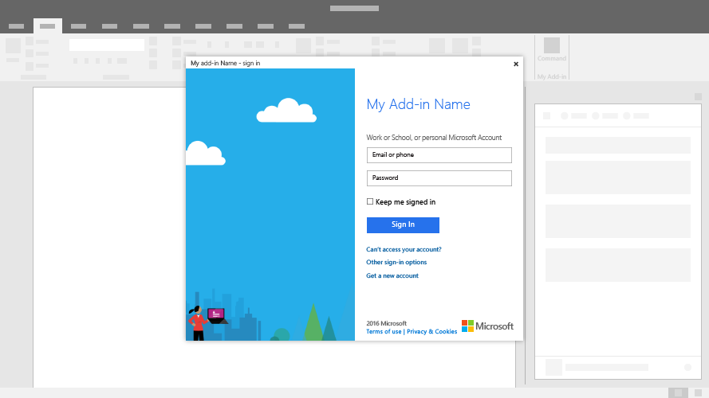

# Dialog boxes in Office Add-ins
 
Dialog boxes are surfaces that float above the active Office application window. You can use dialog boxes to provide additional screen space for tasks such as sign-in pages that can't be opened directly in a task pane or a request to confirm an action taken by a user that could potentially destroy document data, or to show videos that might be too small if confined to a task pane.

**Example: Dialog box**

### Best Practices

|**Do**|**Don't**|
|:-----|:--------|
|Include a descriptive title that includes your add-in name along with the current task at hand.|Don't append your company name to the title.|
| |Don't open a dialog box unless the schenario requires it.| 

## Implementation

For details, see [Dialog object](https://dev.office.com/reference/add-ins/shared/officeui.dialog).

## Additional resources

- [UX Pattern Sample](https://office.visualstudio.com/DefaultCollection/OC/_git/GettingStarted-FabricReact)
- [GitHub Development Resources](https://github.com/OfficeDev/Office-Add-in-UX-Design-Patterns-Code)

