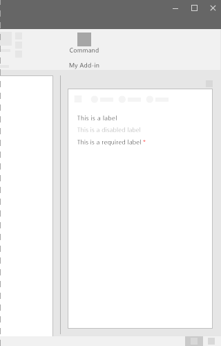

# Label Component in Office UI Fabric

In Add-ins, label is used as a name or title to a component or group of components. It should be in close proximity to the related component or group, they are paired with. Some components have labels incorporated, e.g. dropdown or toggle.
  
#### Example: Label on a task pane

## Best Practices

|**Do**|**Don't**|
|:------------|:--------------|
|Use sentence casing, e.g. “First name.”|Don’t use title casing, e.g. “First Name.”|
|Be short and concise.|Don’t use full sentences or complex punctuation (colons, semicolons, etc.).|
|When adding a Label to components, use the text as a noun or short noun phrase.| |

## Variants

|**Variation**|**Description**|**Example**|
|:------------|:--------------|:----------|
|**Default label**|Use for standard labeling.||
|**Disabled label**|Use when the associated component is disabled.||
|**Required label**|Use when the associated component is required.||

## Implementation

For details, see [Label](https://dev.office.com/fabric#/components/label) on the Office UI Fabric website.

## Additional Resources
* [UX Pattern Sample](https://office.visualstudio.com/DefaultCollection/OC/_git/GettingStarted-FabricReact)
* [GitHub Development Resources](https://github.com/OfficeDev/Office-Add-in-UX-Design-Patterns-Code)