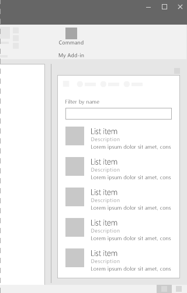

# List Component in Office UI Fabric

List provides a consistent layout to interact with collections. Using List allows user to easily scan through a large collection of content. It is agnostic of layout, the tile component used, and selection management. These concerns can be layered separately. Use List to display content collections, particularly content that is text-heavy.
  
#### Example: List on a task pane

## Best Practices

|**Do**|**Don't**|
|:------------|:--------------|
|End each entry with a period if all entries are complete sentences, if one or more of the entries contains both a fragment and a complete sentence that offers additional information, or if the entries all complete the introductory sentence or fragment.| |
|Consecutive lists on a page should be separated by a heading.| |

## Variants

|**Variation**|**Description**|**Example**|
|:------------|:--------------|:----------|
|**Grid List**|Use when detailed information is needed with each list item.||
|**Variable height item list**|Use when large imagery and text is needed.||

## Implementation

For details, see [List](https://dev.office.com/fabric#/components/list) on the Office UI Fabric website.

## Additional Resources
* [UX Pattern Sample](https://office.visualstudio.com/DefaultCollection/OC/_git/GettingStarted-FabricReact)
* [GitHub Development Resources](https://github.com/OfficeDev/Office-Add-in-UX-Design-Patterns-Code)