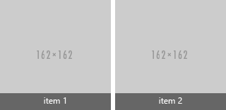

# List component in Office UI Fabric

Lists provide a consistent layout when interacting with large collections of content, even when the content is text-heavy. Lists allow users to easily scan through content. 
  
#### Example: List in a task pane

 

 

## Best practices

- End each entry in a list with a period if:
  - All entries are complete sentences.
  - One or more of the entries contains both a fragment and a complete sentence that offers additional information.
  - The entries all complete the introductory sentence or fragment.
- Separate consecutive lists on a page with headings.

 

## Variants

|**Variation**|**Description**|**Example**|
|:------------|:--------------|:----------|
|**Grid list**|Use when detailed information is needed with each list item.| |
|**Variable height item list**|Use when large imagery and text is needed.| |

 

## Implementation

For details, see [List](https://dev.office.com/fabric#/components/list) and [Getting started with Fabric React code sample](https://github.com/OfficeDev/Word-Add-in-GettingStartedFabricReact).

## Additional resources

- [UX Design Patterns](https://github.com/OfficeDev/Office-Add-in-UX-Design-Patterns-Code)
- [Office UI Fabric in Office Add-ins](office-ui-fabric.md)
