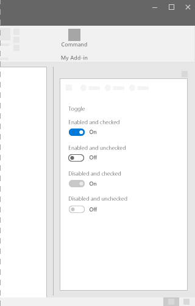
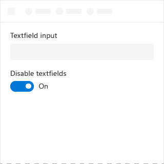
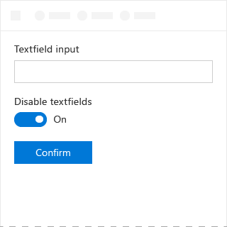

# Toggle Component in Office UI Fabric

In add-ins, Toggles represent a physical switch to turn things on or off. Use Toggles to present two mutually exclusive options (e.g. on/off), where choosing an option results in an immediate action.
  
#### Example: Toggle on a task pane

## Best Practices

|**Do**|**Don't**|
|:------------|:--------------|
|Use a Toggle for binary settings when changes become effective immediately after the user changes them.|Don’t use a Toggle if it requires users to perform an extra step for changes to take effect.|
|||

|**Do**|**Don't**|
|:------------|:--------------|
|Only replace the On and Off labels if there are more specific labels for the setting. If there are short (3-4 characters) labels that represent binary opposites that are more appropriate for a particular setting, use them.| |

## Variants

|**Variation**|**Description**|**Example**|
|:------------|:--------------|:----------|
|**Enabled and checked**|Use when toggled state is active.||
|**Enabled and unchecked**|Use when toggled state is inactive.||
|**Disabled and checked**|Use when the active state cannot be changed.||
|**Disabled and unchecked**|Use when the inactive state cannot be changed.||

## Implementation

For details, see [Toggle](https://dev.office.com/fabric#/components/toggle) on the Office UI Fabric website.

## Additional Resources
* [UX Pattern Sample](https://office.visualstudio.com/DefaultCollection/OC/_git/GettingStarted-FabricReact)
* [GitHub Development Resources](https://github.com/OfficeDev/Office-Add-in-UX-Design-Patterns-Code)