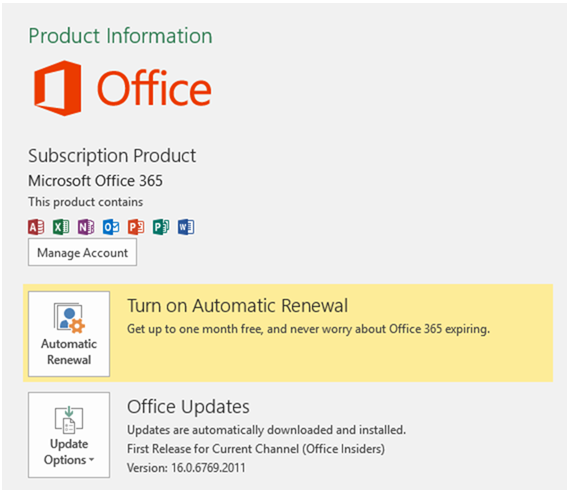

# Install the latest version of Office 2016

New developer features, including those still in preview, are delivered first to subscribers who opt in to get the latest builds of Office. To opt in the latest builds of Office 2016: 

- If you're an Office 365 Home, Personal, or University subscriber, see [Be an Office Insider](https://products.office.com/en-us/office-insider).
- If you're an Office 365 for business customer, see [Install the First Release build for Office 365 for business customers](https://support.office.com/en-us/article/Install-the-First-Release-build-for-Office-365-for-business-customers-4dd8ba40-73c0-4468-b778-c7b744d03ead?ui=en-US&rs=en-US&ad=US).
- If you're running Office 2016 on a Mac:
	- Start an Office 2016 for Mac program.
	- Select **Check for Updates** on the Help menu.
	- In the Microsoft AutoUpdate box, check the box to join the Office Insider program. 

To get the latest build: 

1. Download the [Office 2016 Deployment Tool](https://www.microsoft.com/en-us/download/details.aspx?id=49117). 
2. Run the tool. This extracts the following two files: Setup.exe and configuration.xml.
3. Replace the configuration.xml file with the [First Release Configuration File](https://raw.githubusercontent.com/OfficeDev/Office-Add-in-Commands-Samples/master/Tools/FirstReleaseConfig/configuration.xml).
4. Run the following command as an administrator:  `setup.exe /configure configuration.xml` 

>**Note:** The command might take a long time to run without indicating progress.

When the installation process finishes, you will have the latest Office 2016 applications installed. To verify that you have the latest build, go to **File** > **Account** from any Office application. Under Office Updates, you'll see the (Office Insiders) label above the version number.

## Minimum Office builds for Office JavaScript API requirement sets

For information about the minimum product builds for each platform for the API requirement sets, see the following:

- [Word JavaScript API requirement sets](../../reference/requirement-sets/word-api-requirement-sets)
- [Excel JavaScript API requirement sets](../../reference/requirement-sets/excel-api-requirement-sets)
- [OneNote JavaScript API requirement sets](../../reference/requirement-sets/onenote-api-requirement-sets)
- [Dialog API requirement sets](../../reference/requirement-sets/dialog-api-requirement-sets)
- [Office common API requirement sets](../../reference/requirement-sets/office-add-in-requirement-sets)
