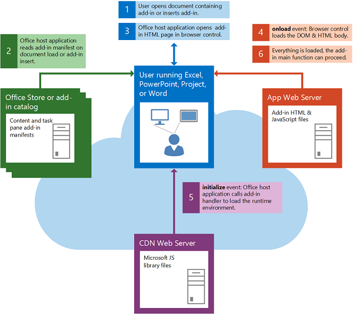
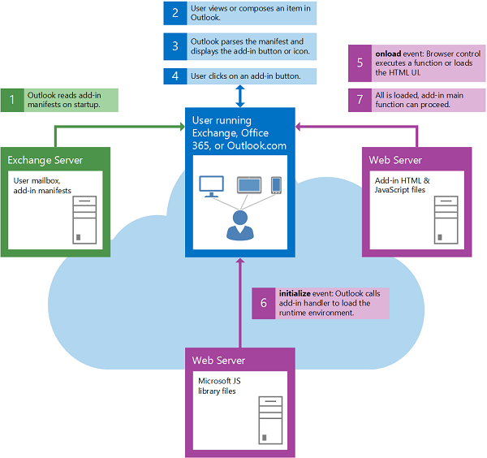

# Loading the DOM and runtime environment


An add-in must ensure that both the DOM and the Office Add-ins runtime environment are loaded before running its own custom logic. 

## Startup of a content or task pane add-in

The following figure shows the flow of events involved in starting a content or task pane add-in in Excel, PowerPoint, Project, Word, or Access.



The following events occur when a content or task pane add-in starts: 


1. The user opens a document that already contains an add-in or inserts an add-in in the document.
    
2. The Office host application reads the add-in's XML manifest from the Office Store, add-in catalog on SharePoint, or shared folder catalog it originates from.
    
3. The Office host application opens the add-in's HTML page in a browser control.
    
    The next two steps, steps 4 and 5, occur asynchronously and in parallel. For this reason, your add-in's code must make sure that both the DOM and the add-in runtime environment have finished loading before proceeding.
    
4. The browser control loads the DOM and HTML body, and calls the event handler for the  **window.onload** event.
    
5. The Office host application loads the runtime environment, which downloads and caches the JavaScript API for JavaScript library files from the content distribution network (CDN) server, and then calls the add-in's event handler for the [initialize](https://dev.office.com/reference/add-ins/shared/office.initialize) event of the [Office](https://dev.office.com/reference/add-ins/shared/office) object.
    
6. When the DOM and HTML body finish loading and the add-in finishes initializing, the main function of the add-in can proceed.
    

## Startup of an Outlook add-in


The following figure shows the flow of events involved in starting an Outlook add-in running on the desktop, tablet, or smartphone.



The following events occur when an Outlook add-in starts: 


1. When Outlook starts, Outlook reads the XML manifests for Outlook add-ins that have been installed for the user's email account.
    
2. The user selects an item in Outlook.
    
3. If the selected item satisfies the activation conditions of an Outlook add-in, Outlook activates the add-in and makes its button visible in the UI.
    
4. If the user clicks the button to start the Outlook add-in, Outlook opens the HTML page in a browser control. The next two steps, steps 5 and 6, occur in parallel.
    
5. The browser control loads the DOM and HTML body, and calls the event handler for the  **onload** event.
    
6. Outlook calls the event handler for the [initialize](https://dev.office.com/reference/add-ins/shared/office.initialize) event of the [Office](https://dev.office.com/reference/add-ins/shared/office) object of the add-in.
    
7. When the DOM and HTML body finish loading and the add-in finishes initializing, the main function of the add-in can proceed.
    

## Checking the load status


One way to check that both the DOM and the runtime environment have finished loading is to use the jQuery [.ready()](http://api.jquery.com/ready/) function: `$(document).ready()`. For example, the following  **initialize** event handler function makes sure the DOM is first loaded before the code specific to initializing the add-in runs. Subsequently, the **initialize** event handler proceeds to use the [mailbox.item](/reference/outlook/Office.context.mailbox.item.md) property to obtain the currently selected item in Outlook, and calls the main function of the add-in, `initDialer`.


```js
Office.initialize = function () {
    // Checks for the DOM to load.
    $(document).ready(function () {
        // After the DOM is loaded, add-in-specific code can run.
        var mailbox = Office.context.mailbox;
        _Item = mailbox.item;
        initDialer();
    });
}
```

This same technique can be used in the  **initialize** handler of any Office Add-in.

The phone dialer sample Outlook add-in shows a slightly different approach using only JavaScript to check these same conditions. 

> [!IMPORTANT]
> Even if your add-in has no initialization tasks to perform, you must include at least a minimal **Office.initialize** event handler function like the following example.

```js
Office.initialize = function () {
};
```

If you fail to include an  **Office.initialize** event handler, your add-in may raise an error when it starts. Also, if a user attempts to use your add-in with an Office Online web client, such as Excel Online, PowerPoint Online, or Outlook Web App, it will fail to run.

If your add-in includes more than one page, whenever it loads a new page that page must include or call an  **Office.initialize** event handler.


## Additional resources

- [Understanding the JavaScript API for Office](understanding-the-javascript-api-for-office.md)
    
