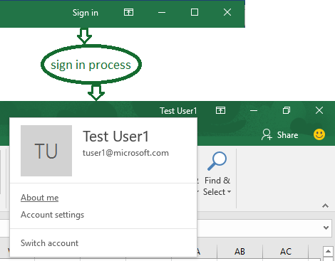

# Enable single sign-on for Office Add-ins (preview)

You can take advantage of single-sign on (SSO) in your Office Add-in. With SSO, users can sign in to Office (online, mobile, and desktop platforms) with either their personal Microsoft account or their work or school (Office 365) account. 

<!-- Should we add a Preview notice as well, to be clear? 
-->

>**Note:** This feature is currently in preview and is subject to change in future releases. For this preview, single sign-on is supported only for work or school (Office 365) accounts and only for desktop versions of Office. 



Your add-in can use SSO to do the following - without requiring the user to sign in a second time:

* Authorize the user to your add-in
* Authorize the add-in to access [Microsoft Graph](https://developer.microsoft.com/graph/docs) 

For users, this makes running your add-in a smooth experience that involves at most a one-time consent screen. For developers, this means that your add-in can authenticate users and gain authorized access to the user’s data via Microsoft Graph with credentials that the Office application has already gathered.
 

### SSO add-in architecture

In addition to hosting the pages and JavaScript of the web application, the add-in must also host, *at the same [fully qualified domain name](https://msdn.microsoft.com/en-us/library/windows/desktop/ms682135(v=vs.85).aspx#_dns_fully_qualified_domain_name_fqdn__gly)*, one or more web APIs that will get an access token to Microsoft Graph and make requests to it.

The add-in manifest contains markup that specifies how the add-in is registered in the Azure Active Directory (Azure AD) v2.0 endpoint, and it specifies any permissions to Microsoft Graph that the add-in needs.

### How it works at runtime

The diagram below shows how the SSO process works. 


1. JavaScript in the add-in calls a new Office.js API `getAccessTokenAsync`. This tells the Office host application to obtain an access token to the add-in. (Hereafter, this is called the “add-in token”.)
1. [Occurs only if needed] If the user is not signed in, the Office host application opens a popup for the user to sign in. 
1. [Occurs only if needed] If this is the first time the current user has used your add-in, s/he is prompted to consent. 
1. The Office host application requests the add-in token from the Azure AD V2 endpoint for the current user.
1. Azure AD sends the add-in token to the Office host application.
1. The Office host application sends the add-in token to the add-in as part of the result object returned by the call of `getAccessTokenAsync`.
1. JavaScript in the add-in makes an HTTP Request to a Web API that is hosted *at the same fully-qualified domain* as the add-in, and it includes the add-in token as authorization proof.  
1. Server-side code validates the incoming add-in token.
1. Server-side code uses the “on behalf of” flow (defined at [OAuth2 Token Exchange](https://tools.ietf.org/html/draft-ietf-oauth-token-exchange-02) and this [Azure Scenario](https://docs.microsoft.com/en-us/azure/active-directory/develop/active-directory-authentication-scenarios#daemon-or-server-application-to-web-api) guide) to obtain an access token for Microsoft Graph (hereafter, the “MSG token”) in exchange for the add-in token. 
1. AAD returns the MSG token (and a refresh token, if the add-in requests offline_access permission) to the add-in.
1. Server-side code caches the token(s).
1. Server-side code makes requests to Microsoft Graph and includes the MSG token.
1. Microsoft Graph returns data to the add-in, which can pass it on to the add-in’s UI. 
1. [Occurs as needed] When the MSG token expires, the server-side code can use its refresh token to obtain a new MSG token.

### Development tasks

These are the major tasks required to create an Office Add-in that uses Single Sign-on described in a language-agnostic, framework-agnostic way. (Links to detailed walkthroughs are below.)

###### Create the Service Application

Register the add-in at the registration portal for the Azure V2 endpoint: `apps.dev.microsoft.com`. This is a 5 – 10 minute process that includes:

* Obtaining a client ID and secret for the add-in.
* Specifying the permissions that your add-in needs to Microsoft Graph.
* Granting trust to the Office host application to the add-in.
* Preauthorizing the Office host application to the add-in with the default permission “access_as_user”.

###### Configure the add-in

Add new markup to the add-in manifest:

* **WebApplicationID** is the client ID of the add-in.
* **WebApplicationResource** is the URL of the add-in.
* **WebApplicationScopes** specifies the permissions that the Office host needs to the add-in and that the add-in needs to MS Graph. In general, you’ll always want User.Read, but you can request more access (e.g. Mail.Read or offline_access).

###### Code the client-side

Add JavaScript to the add-in to:

* Call `Office.context.auth.getAccessTokenAsync(myTokenHandler)`.
* Create a handler that passes the add-in token to the add-in’s server-side code. For example:
* 
```js
function mytokenHandler(asyncResult) {
    // passes asyncResult.value (which has the add-in access token)
    // to the add-in’s Web API as a Bearer type Authorization header.
}
```

###### Code the server-side

Create one or more Web API methods that get MS Graph data. Depending on your language and framework, there may be libraries that will greatly simplify the code you have to write. Your server-side code needs to do the following:

* Validate the add-in token that is received from the token handler you created in Step 3.
* Initiate the “on behalf of” flow with a call to the Azure AD V2 endpoint that includes the add-in access token, some metadata about the user, and the credentials of the add-in (its ID and secret). 
* Cache the returned MSG token.
* Get data from MS Graph using the MSG token.

### Detailed walkthroughs

* For an NodeJS add-in: [Create a NodeJS Office Add-in that uses Single Sign-on](../../docs/develop/create-sso-office-add-ins-nodejs.md).
* For an ASP.NET add-in: [Create an ASP.NET Office Add-in that uses Single Sign-on](../../docs/develop/create-sso-office-add-ins-aspnet.md).


