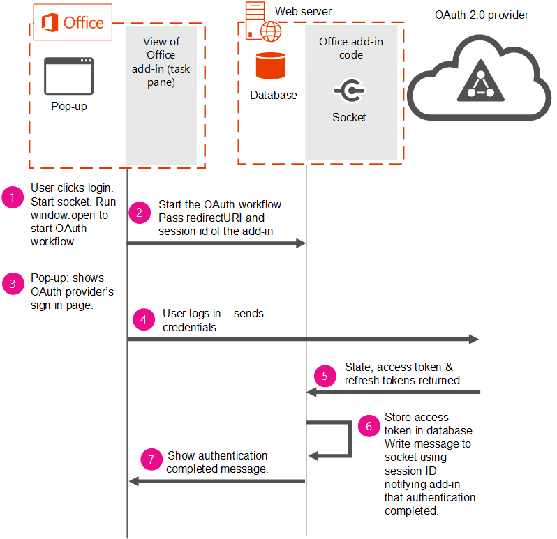

# Use the OAuth authorization framework in an Office Add-in

OAuth is the open standard for authorization that online service providers such as Office 365, Facebook, Google, SalesForce, LinkedIn and others use to perform user authentication. The OAuth authorization framework is the default authorization protocol used in Azure and Office 365. The OAuth authorization framework is used in both enterprise (corporate) and consumer scenarios.

Online service providers may provide public APIs exposed via REST. Developers can use these public APIs in their Office add-ins to read or write data to the online service provider. Integrating data from online service providers in an add-in increases its value, which leads to greater user adoption. When using these APIs in your add-in, users will be required to authenticate using the OAuth authorization framework.

This topic describes how to implement an authentication flow in your add-in to perform user authentication. Code segments included in this topic are taken from the [Office-Add-in-NodeJS-ServerAuth](https://github.com/OfficeDev/Office-Add-in-NodeJS-ServerAuth) code sample.

 **Note**  For security reasons, browsers are not allowed to display sign-in pages in an IFrame. Depending on the version of Office that your customers use, most notably web-based versions, your add-in is displayed in an IFrame. This imposes some considerations on how to manage the authentication flow. 

The following diagram shows the required components and the flow of events that occur when implementing authentication in your add-in.



The diagram shows how the following required components are used:


- Office runs a task pane add-in on the user's computer. Your add-in opens a pop-up window to start the authentication flow. Add-ins cannot start authentication flows directly because add-ins, depending on the platform used, may run in an IFRAME. For security reasons, OAuth sign-in pages can't be displayed in an IFRAME. 
    
- A web server hosts your add-in's code. This code sample uses a database server running on the web server to store the user's access token. Persisting the access token is necessary so that after authentication completes using the pop-up window, the main add-in's pages can use the same tokens to access data from the online service. Saving the tokens by using server-side options is necessary because you can't rely on information passed from the add-in or the pop-up.
    
- The OAuth 2.0 provider performs user authentication.
    

    
 **Important**  Access tokens can't be returned to the task pane, but they can be used on the server. In this code sample, the access tokens are stored in the database for 2 minutes. After 2 minutes, tokens are purged from the database and users are prompted to re-authenticate. Before changing this time period in your own implementation, consider the security risks associated with storing access tokens in a database for a time period that is longer than 2 minutes.


## Step 1 - Start socket and open a pop-up window

When you run this code sample, a task pane add-in displays in Office. When the user chooses an OAuth provider to log into, the add-in first creates a socket. This sample uses a socket to provide a good user experience in the add-in. The add-in uses the socket to communicate the success or failure of the authentication to the user. By using a socket, the add-in's main page is easily updated with the authentication status, and doesn't require user interaction or polling. The following code segment, taken from routes/connect.js, shows how to start the socket. The socket is named using  **decodedNodeCookie**, which is the add-in's session ID. This code sample creates the socket by using [socket.io](http://socket.io/).


```js
io.on('connection', function (socket) {
  console.log('Socket connection established');
  var jsonCookie =
    cookie.parse(socket
      .handshake
      .headers
      .cookie);
  var decodedNodeCookie =
    cookieParser
      .signedCookie(jsonCookie.nodecookie, '<Insert a random string>');
  console.log('Decoded cookie: ' + decodedNodeCookie);
  // The session ID becomes the room name for this session.
  socket.join(decodedNodeCookie);
  io.to(decodedNodeCookie).emit('init', 'Private socket session established');
});

```

Next, the add-in connects to the socket. The following code can be found in /public/javascripts/client.js.


```js
var socket = io.connect('https://localhost:3001', { secure: true });
```

Next, the add-in opens a pop-up window on the user's computer using  **window.open**. When running  **window.open**, ensure the redirect URI and session ID of the add-in is passed in the URL. The session ID of the add-in is used to identify the socket to use when sending authentication status information to the add-in's UI. The following code segment can be found in views/index.jade.


```js
onclick="window.open('/connect/azure/#{sessionID}', 'AuthPopup', 'width=500,height=500,centerscreen=1,menubar=0,toolbar=0,location=0,personalbar=0,status=0,titlebar=0,dialog=1')")
```


## Steps 2 &amp; 3 - Start the authentication flow and show the sign-in page

The add-in must start the authentication flow. The code segment below uses the Passport OAuth library. When starting the authentication flow, ensure that you pass the authorization URL of the OAuth provider, and the session ID of the add-in. The session ID of the add-in must be passed in the state parameter. The pop-up window now displays the OAuth provider's sign-in page so that users can sign in.


```js
router.get('/azure/:sessionID', function(req, res, next) { 
   passport.authenticate( 
     'azure',  
     { state: req.params.sessionID }, 

```


## Steps 4, 5 &amp; 6 - User signs in and web server receives tokens

 After a successful sign-in, an access token, refresh token, and state parameter are returned to the add-in. The state parameter contains the session ID, which is used to send authentication status information to the socket in step 7. The following code segment, taken from app.js, stores the access token in the database.


```js
  dbHelperInstance.insertDoc(userData, null, 
         function (err, body) { 
           if (!err) { 
             console.log("Inserted session entry [" + userData.sessid + "] id: " + body.id); 
           } 
           done(err, userData); 
         }); 

```


## Step 7 - Show authentication information in the add-in's UI

The following code segment, taken from connect.js, updates the add-in's UI with the authentication status information. The add-in's UI is updated by using the socket that was created in step 1.


```js
  
       io.to(user.sessid).emit('auth_success', providers); 
       next(); 

```


## Additional resources
<a name="bk_addresources"> </a>


- [Office-Add-in-NodeJS-ServerAuth](https://github.com/OfficeDev/Office-Add-in-NodeJS-ServerAuth)
    
