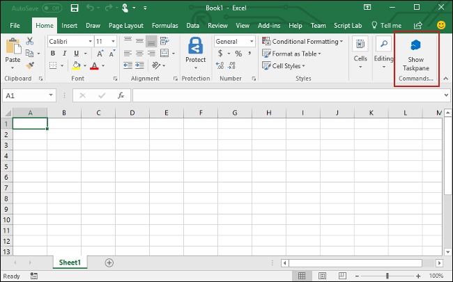

# Build an Excel add-in using jQuery

In this article, you'll walk through the process of building an Excel add-in by using jQuery and the Excel JavaScript API.

## Prerequisites

If you haven't done so previously, you'll need to install [Yeoman](https://github.com/yeoman/yo) and the [Yeoman generator for Office Add-ins](https://github.com/OfficeDev/generator-office) globally.

```bash
    npm install -g yo generator-office
```

## Create the web app

1. Create a folder on your local drive and name it **my-addin**. This is where you'll create the files for your app.

2. Navigate to your app folder.

    ```bash
    cd my-addin
    ```

3. Use the Yeoman generator to generate the manifest file for your add-in. Run the following command and then answer the prompts as shown in the following screenshot:

    ```bash
    yo office
    ```
    


4. In your code editor, open **index.html** in the root of the project. This file specifies the HTML that will be rendered in the add-in's task pane. 
 
5. Replace the generated `header` tag with the following markup.
 
    ```html
    <div id="content-header">
        <div class="padding">
            <h1>Welcome</h1>
        </div>
    </div>
    ```

6. Replace the generated `main` tag with the following markup and save the file.

    ```html
    <div id="content-main">
        <div class="padding">
            <p>Choose the button below to set the color of the selected range to green.</p>
            <br />
            <h3>Try it out</h3>
            <button class="ms-Button" id="set-color">Set color</button>
        </div>
    </div>
    ```

7. Open the file **app.js** to specify the script for the add-in. Replace the generated immediately invoked function expression with the following code and save the file.

    ```js
    (function () {
        "use strict";

        Office.initialize = function (reason) {
            $(document).ready(function () {
                $('#set-color').click(setColor);
            });
        };

        function setColor() {
            Excel.run(function (context) {
                var range = context.workbook.getSelectedRange();
                range.format.fill.color = 'green';

                return context.sync();
            }).catch(function (error) {
                console.log("Error: " + error);
                if (error instanceof OfficeExtension.Error) {
                    console.log("Debug info: " + JSON.stringify(error.debugInfo));
                }
            });
        }
    })();
    ```

8. Open the file **app.css** to specify the custom styles for the add-in. Replace the contents (except the copyright comment) with the following and save the file.

    ```css
    #content-header {
        background: #2a8dd4;
        color: #fff;
        position: absolute;
        top: 0;
        left: 0;
        width: 100%;
        height: 80px; 
        overflow: hidden;
    }

    #content-main {
        background: #fff;
        position: fixed;
        top: 80px;
        left: 0;
        right: 0;
        bottom: 0;
        overflow: auto; 
    }

    .padding {
        padding: 15px;
    }
    ```

## Configure the manifest file and sideload the add-in

1. Open the file **my-office-add-in-manifest.xml** to define the add-in's settings and capabilities. 

2. The **ProviderName** tag has a placeholder value. Change it to `Microsoft`.

3. The **DefaultValue** of the **DisplayName** tag has a placeholder value. Change it to `A task pane add-in for Excel`. 

4. Save the file but don't close it yet.

## Configure to use HTTP

Office Web Add-ins should use HTTPS, not HTTP, even when you are developing. However, to get the add-in up and running fast, this quick start will use HTTP. To enable this, take these steps:

1. In the manifest file **my-office-add-in-manifest.xml**, replace "https" with "http" everywhere. Then save and close the file.

2. Open the **bsconfig.json** file in the root of the project. Change the value of the **https** property to `false`. Save the file.


## Try it out

1. Follow the instructions for the platform you'll use to run your add-in to sideload the add-in within Excel.

    - Windows: [Sideload Office Add-ins for testing on Windows](../testing/create-a-network-shared-folder-catalog-for-task-pane-and-content-add-ins.md)
    - Excel Online: [Sideload Office Add-ins in Office Online](../testing/sideload-office-add-ins-for-testing.md#sideload-an-office-add-in-on-office-online)
    - iPad and Mac: [Sideload Office Add-ins on iPad and Mac](../testing/sideload-an-office-add-in-on-ipad-and-mac.md)

2. Open a bash terminial in the root of the project and run the following command to start the dev server.

    ```bash
    npm start
    ```

   > [!NOTE]
   > A browser window will open with the add-in in it. Close this window.

3. In Excel, choose the **Home** tab, and then choose the **Show Taskpane** button in the ribbon to open the add-in task pane.

    

4. Select any range of cells in the worksheet.

5. In the task pane, choose the **Color Me** button pane to set the color of the selected range to green.

    

## Next steps

Congratulations, you've successfully created an Excel add-in using jQuery! Next, learn more about the [core concepts](excel-add-ins-core-concepts.md) of building Excel add-ins.

## Additional resources

* [Excel JavaScript API core concepts](excel-add-ins-core-concepts.md)
* [Excel add-in code samples](http://dev.office.com/code-samples#?filters=excel,office%20add-ins)
* [Excel JavaScript API reference](https://dev.office.com/reference/add-ins/excel/excel-add-ins-reference-overview)
