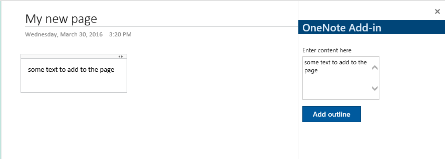
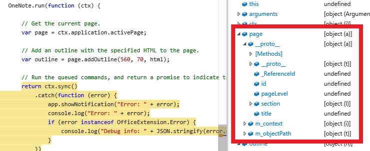

# Build your first OneNote add-in

This article walks you through building a simple task pane add-in that adds some text to a OneNote page.

The following image shows the add-in that you'll create.

   

<a name="setup"></a>
## Step 1: Set up your dev environment and create an add-in project
Follow the instructions to [Create an Office Add-in Using Any Editor](https://dev.office.com/docs/add-ins/get-started/create-an-office-add-in-using-any-editor) to install the necessary prerequisites and run the Office Yeoman generator to create a new add-in project. When selecting the project attributes in the Yeoman generator, make sure to specify OneNote as a host, as shown below:

| Option | Value |
|:------|:------|
| Project name | OneNote Add-in |
| Root folder of project | (accept the default) |
| Office project type | Task Pane Add-in |
| Supported Office applications | (Make sure OneNote is selected) |
| Technology to use | HTML, CSS & JavaScript |

<a name="develop"></a>
## Step 2: Modify the add-in
You can edit the add-in files using any text editor or IDE. If you haven't tried Visual Studio Code yet, you can [download it for free](https://code.visualstudio.com/) on Linux, Mac OSX, and Windows.

1. Open **home.html** in the *app/home* folder. 

2. Edit the references to the Office JavaScript API and [Office UI Fabric](http://dev.office.com/fabric) styles and components.

  a. Uncomment the link to fabric.components.min.css.
  b. Replace the script reference to Office.js with the following reference to the *beta* version.

  ```
  <script src="https://appsforoffice.microsoft.com/lib/1.1/hosted/office.js"></script>
  ```

  Your Office references will look like this.

  ```
  <link href="//appsforoffice.microsoft.com/fabric/1.0/fabric.min.css" rel="stylesheet">
  <link href="//appsforoffice.microsoft.com/fabric/1.0/fabric.components.min.css" rel="stylesheet">
  <script src="https://appsforoffice.microsoft.com/lib/1.1/hosted/office.js"></script>
  ```

3. Replace the `<body>` element with the following code. This adds a text area and a button using [Office UI Fabric components](http://dev.office.com/fabric/components). The **Responsive Grid** layout is from the set of [Office UI Fabric styles](http://dev.office.com/fabric/styles). 

  ```
  <body class="ms-font-m">
      <div class="home flex-container">
          <div class="ms-Grid">
              <div class="ms-Grid-row ms-bgColor-themeDarker">
                  <div class="ms-Grid-col">
                      <span class="ms-font-xl ms-fontColor-themeLighter ms-fontWeight-semibold">OneNote Add-in</span>
                  </div>
              </div>
          </div>
          <br />
          <div class="ms-Grid">
              <div class="ms-Grid-row">
                  <div class="ms-Grid-col">
                      <label class="ms-Label">Enter content here</label>
                      <div class="ms-TextField ms-TextField--placeholder">
                          <textarea id="textBox" rows="5"></textarea>
                      </div>
                  </div>
              </div>
              <div class="ms-Grid-row">
                  <div class="ms-Grid-col">
                      <div class="ms-font-m ms-fontColor-themeLight header--text">
                          <button class="ms-Button ms-Button--primary" id="addOutline">
                              <span class="ms-Button-icon"><i class="ms-Icon"></i></span>
                              <span class="ms-Button-label">Add outline</span>
                              <span class="ms-Button-description">Adds the content above to the current page.</span>
                          </button>
                      </div>
                  </div>
              </div>
          </div>
      </div>
  </body>
  ```

4. Open **home.js** in the *app/home* folder. Edit the **Office.initialize** function to add a click event to the **Add outline** button, as follows. 

  ```
  // The initialize function is run each time the page is loaded.
  Office.initialize = function (reason) {
      $(document).ready(function () {
          app.initialize();
  
          // Set up event handler for the UI.
          $('#addOutline').click(addOutlineToPage);
      });
  };
  ```
 
5. Replace the **getDataFromSelection** method with the following **addOutlineToPage** method. This gets the content from the text area and adds it to the page.

  ```
  // Add the contents of the text area to the page.
  function addOutlineToPage() {        
      OneNote.run(function (context) {
         var html = '<p>' + $('#textBox').val() + '</p>';
  
          // Get the current page.
          var page = context.application.getActivePage();
  
          // Queue a command to load the page with the title property.             
          page.load('title'); 
  
          // Add an outline with the specified HTML to the page.
          var outline = page.addOutline(40, 90, html);
  
          // Run the queued commands, and return a promise to indicate task completion.
          return context.sync()
              .then(function() {
                  console.log('Added outline to page ' + page.title);
              })
              .catch(function(error) {
                  app.showNotification("Error: " + error); 
                  console.log("Error: " + error); 
                  if (error instanceof OfficeExtension.Error) { 
                      console.log("Debug info: " + JSON.stringify(error.debugInfo)); 
                  } 
              }); 
          });
  }
  ```

<a name="test"></a>
## Step 3: Test the add-in on OneNote Online
1. Run the Gulp web server.  

  a. Open a **cmd** prompt and go to the add-in project folder. 
  b. Run the `gulp serve-static` command, as shown below.

  ```
  C:\your-local-path\onenote add-in\> gulp serve-static
  ```

2. Install the Gulp web server's self-signed certificate as a trusted certificate. You only need to do this one time on your computer for all add-in projects created with the Office Yeoman generator.

   a. Navigate to the hosted add-in page. By default, this is the same URL that's in your manifest:

  ```
  https://localhost:8443/app/home/home.html
  ```

   b. Install the certificate as a trusted certificate. For more information, see [Adding Self-Signed Certificates as Trusted Root Certificate](https://github.com/OfficeDev/generator-office/blob/master/docs/trust-self-signed-cert.md).

3. Go to [OneNote Online](https://www.onenote.com/notebooks) and open a notebook.

4. Choose **Insert > Office Add-ins**. This opens the Office Add-ins dialog.
  - If you're logged in with your consumer account, choose the **MY ADD-INS** tab, and then choose  **Upload My Add-in**.
  - If you're logged in with your work or school account, choose the **MY ORGANIZATION** tab, and then choose  **Upload My Add-in**. 
  
  The following image shows the **MY ADD-INS** tab for consumer notebooks.

  

5. In the Upload Add-in dialog, browse to **manifest-onenote-add-in.xml** in your project folder, and then choose **Upload**. While testing, your manifest file will be stored in the browser's local storage.

6. The add-in opens in an iFrame next to the OneNote page. Enter some text in the text area and then choose **Add outline**. The text you entered is added to the page. 

## Troubleshooting and tips
- You can debug the add-in using your browser's developer tools. When you're using the Gulp web server and debugging in Internet Explorer or Chrome, you can save your changes locally and then just refresh the add-in's iFrame.

- When you inspect a OneNote object, the properties that are currently available for use display actual values. Properties that need to be loaded display *undefined*. Expand the `_proto_` node to see properties that are defined on the object but are not yet loaded.

      

- You need to enable mixed content in the browser if your add-in uses any HTTP resources. Production add-ins should use only secure HTTPS resources.

-  Task pane add-ins can be opened from anywhere, but content add-ins can only be inserted inside regular page content (i.e. not in titles, images, iFrames, etc.). 

## Additional Resources

- [OneNote JavaScript API programming overview](onenote-add-ins-programming-overview.md)
- [OneNote JavaScript API reference](../../reference/onenote/onenote-add-ins-javascript-reference.md)
- [Rubric Grader sample](https://github.com/OfficeDev/OneNote-Add-in-Rubric-Grader)
- [Office Add-ins platform overview](https://dev.office.com/docs/add-ins/overview/office-add-ins)
