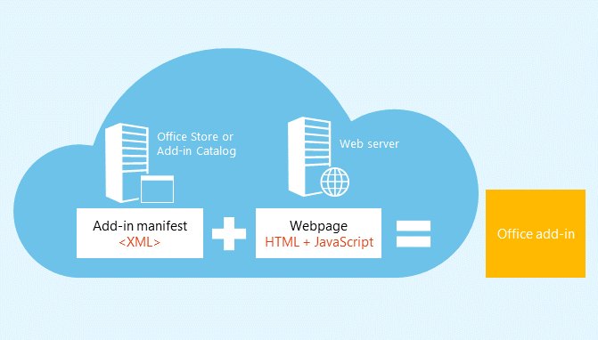
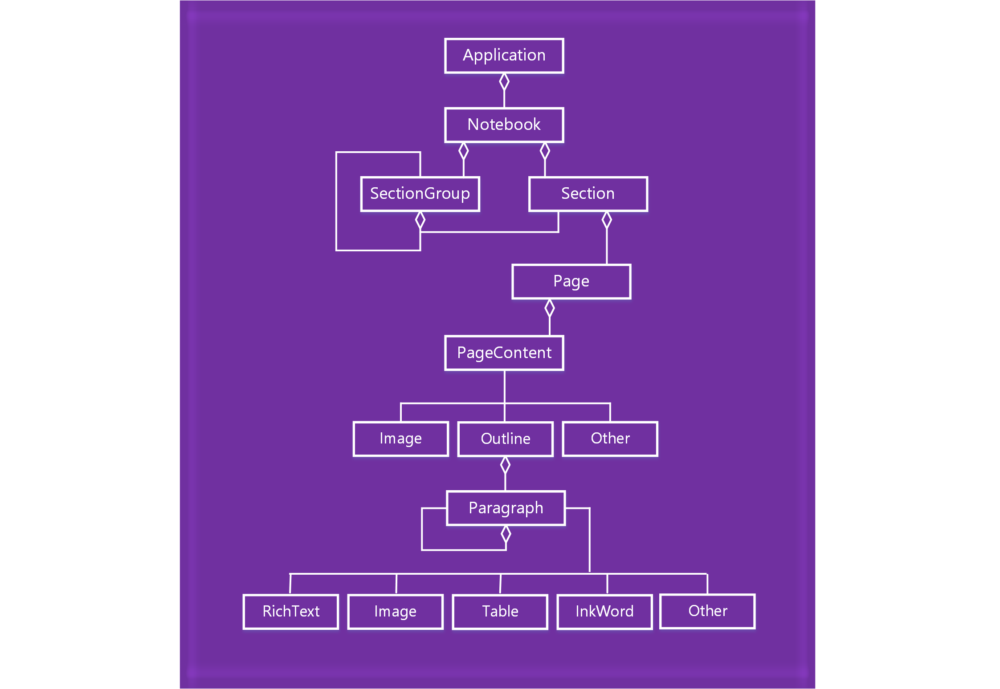

# OneNote JavaScript API programming overview

OneNote introduces a JavaScript API for OneNote Online add-ins. You can create task pane add-ins, content add-ins, and add-in commands that interact with OneNote objects and connect to web services or other web-based resources.

> [!NOTE]
> When you build your add-in, if you plan to [publish](../publish/publish.md) your add-in to the Office Store, make sure that you conform to the [Office Store validation policies](https://msdn.microsoft.com/en-us/library/jj220035.aspx). For example, to pass validation, your add-in must work across all platforms that support the methods that you define (for more information, see [section 4.12](https://msdn.microsoft.com/en-us/library/jj220035.aspx#Anchor_3) and the [Office Add-in host and availability page](https://dev.office.com/add-in-availability)).

## Components of an Office Add-in

Add-ins consist of two basic components:

- A **web application** consisting of a webpage and any required JavaScript, CSS, or other files. These files are hosted on a web server or web hosting service, such as Microsoft Azure. In OneNote Online, the web application displays in a browser control or iframe.
	
- An **XML manifest** that specifies the URL of the add-in's webpage and any access requirements, settings, and capabilities for the add-in. This file is stored on the client. OneNote add-ins use the same [manifest](https://dev.office.com/docs/add-ins/overview/add-in-manifests) format as other Office Add-ins.

**Office Add-in = Manifest + Webpage**



## Using the JavaScript API

Add-ins use the runtime context of the host application to access the JavaScript API. The API has two layers: 

- A **rich API** for OneNote-specific operations, accessed through the **Application** object.
- A **common API** that's shared across Office applications, accessed through the **Document** object.

### Accessing the rich API through the *Application* object

Use the **Application** object to access OneNote objects such as **Notebook**, **Section**, and **Page**. With rich APIs, you run batch operations on proxy objects. The basic flow goes something like this: 

1. Get the application instance from the context.

2. Create a proxy that represents the OneNote object you want to work with. You interact synchronously with proxy objects by reading and writing their properties and calling their methods. 

3. Call **load** on the proxy to fill it with the property values specified in the parameter. This call is added to the queue of commands.

   > [!NOTE]
   > Method calls to the API (such as `context.application.getActiveSection().pages;`) are also added to the queue.

4. Call **context.sync** to run all queued commands in the order that they were queued. This synchronizes the state between your running script and the real objects, and by retrieving properties of loaded OneNote objects for use in your script. You can use the returned promise object for chaining additional actions.

For example: 

```
    function getPagesInSection() {
        OneNote.run(function (context) {
            
            // Get the pages in the current section.
            var pages = context.application.getActiveSection().pages;
            
            // Queue a command to load the id and title for each page.            
            pages.load('id,title');
            
            // Run the queued commands, and return a promise to indicate task completion.
            return context.sync()
                .then(function () {
                    
                    // Read the id and title of each page. 
                    $.each(pages.items, function(index, page) {
                        var pageId = page.id;
                        var pageTitle = page.title;
                        console.log(pageTitle + ': ' + pageId); 
                    });
                })
                .catch(function (error) {
                    app.showNotification("Error: " + error);
                    console.log("Error: " + error);
                    if (error instanceof OfficeExtension.Error) {
                        console.log("Debug info: " + JSON.stringify(error.debugInfo));
                    }
                });
        });
    }
```

You can find supported OneNote objects and operations in the [API reference](../../reference/onenote/onenote-add-ins-javascript-reference.md).

### Accessing the common API through the *Document* object

Use the **Document** object to access the common API, such as the [getSelectedDataAsync](https://dev.office.com/reference/add-ins/shared/document.getselecteddataasync)
and [setSelectedDataAsync](https://dev.office.com/reference/add-ins/shared/document.setselecteddataasync) methods. 

For example:  

```
function getSelectionFromPage() {
    Office.context.document.getSelectedDataAsync(
        Office.CoercionType.Text,
        { valueFormat: "unformatted" },
        function (asyncResult) {
            var error = asyncResult.error;
            if (asyncResult.status === Office.AsyncResultStatus.Failed) {
                console.log(error.message);
            }
            else $('#input').val(asyncResult.value);
        });
}
```
OneNote add-ins support only the following common APIs:

| API | Notes |
|:------|:------|
| [Office.context.document.getSelectedDataAsync](https://msdn.microsoft.com/en-us/library/office/fp142294.aspx) | **Office.CoercionType.Text** and **Office.CoercionType.Matrix** only |
| [Office.context.document.setSelectedDataAsync](https://msdn.microsoft.com/en-us/library/office/fp142145.aspx) | **Office.CoercionType.Text**, **Office.CoercionType.Image**, and **Office.CoercionType.Html** only | 
| [var mySetting = Office.context.document.settings.get(name);](https://msdn.microsoft.com/en-us/library/office/fp142180.aspx) | Settings are supported by content add-ins only | 
| [Office.context.document.settings.set(name, value);](https://msdn.microsoft.com/en-us/library/office/fp161063.aspx) | Settings are supported by content add-ins only | 
| [Office.EventType.DocumentSelectionChanged](https://dev.office.com/reference/add-ins/shared/document.selectionchanged.event) ||

In general, you only use the common API to do something that isn't supported in the rich API. To learn more about using the common API, see the Office Add-ins [documentation](https://dev.office.com/docs/add-ins/overview/office-add-ins) and [reference](https://dev.office.com/reference/add-ins/javascript-api-for-office).


<a name="om-diagram"></a>
## OneNote object model diagram 
The following diagram represents what's currently available in the OneNote JavaScript API.

  


## Additional resources

- [Build your first OneNote add-in](onenote-add-ins-getting-started.md)
- [OneNote JavaScript API reference](../../reference/onenote/onenote-add-ins-javascript-reference.md)
- [Rubric Grader sample](https://github.com/OfficeDev/OneNote-Add-in-Rubric-Grader)
- [Office Add-ins platform overview](https://dev.office.com/docs/add-ins/overview/office-add-ins)
