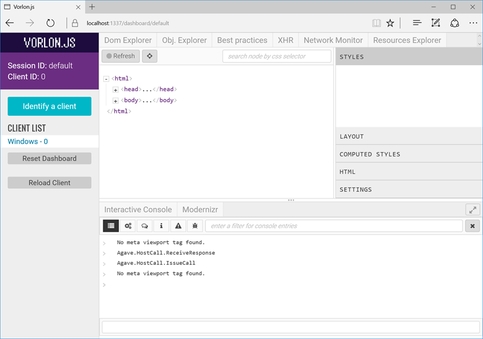

# Debug Office Add-ins on iPad and Mac

You can use Visual Studio to develop and debug add-ins on Windows, but you can't use it to debug add-ins on the iPad or Mac. Because add-ins are developed using HTML and Javascript, they are designed to work across platforms, but there might be subtle differences in how different browsers render the HTML. This article describes how to debug add-ins running on an iPad or Mac. 

## Debugging with Vorlon.js 

Vorlon.js is a debugger for web pages, similar to the F12 tools, that is designed to work remotely and allows you to debug web pages across different devices. For more information, see the [Vorlon website](http://www.vorlonjs.com).  

To install and set up up Vorlon: 

1.	Install [Node.js](https://nodejs.org) if you haven't already. 

2.	Install Vorlon using npm with the following command: `sudo npm i -g vorlon` 

3.	Run the Vorlon server with the command `vorlon`. 

4.	Open a browser window and go to [http://localhost:1337](http://localhost:1337), which is the Vorlon interface.

5.	Add the following script tag to the `<head>` section of the home.html file (or main HTML file) of your add-in:
```    
<script src="http://localhost:1337/vorlon.js"></script>    
```  

>**Note:** Note: using Vorlon.js for add-in debugging requires that https is enabled in Vorlon. To learn how to do that, see [VorlonJS plugin for debugging Office Addin](https://blogs.msdn.microsoft.com/mim/2016/02/18/vorlonjs-plugin-for-debugging-office-addin/)

Now, whenever you open the add-in on a device, it will show up in the list of Clients in Vorlon (on the left side of the Vorlon interface). You can remotely highlight DOM elements, remotely execute commands, and much more.  



A dedicated Vorlon plugin for Office Add-ins adds extra capabilities such as interacting with the Office.js APIs. For more information, see the blog post [VorlonJS plugin for debugging Office Addin](https://blogs.msdn.microsoft.com/mim/2016/02/18/vorlonjs-plugin-for-debugging-office-addin/). To enable the Office Add-ins plugin: 

1.	Locally clone the dev branch of the Vorlon.js GitHub repository by using the following commands: 
```
git clone https://github.com/MicrosoftDX/Vorlonjs.git
git checkout dev
npm install
```

2.	Open the **config.json** file located in /Vorlon/Server/config.json. To activate the Office Addin plugin, set the **enabled** property to **true**.

 
