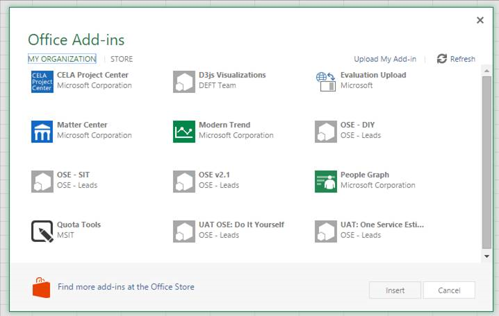

# Sideload Office Add-ins in Office Online for testing

You can install an Office Add-in for testing without having to first put it in an add-in catalog by using sideloading. Sideloading can be done on either Office 365 or Office Online. The procedure is slightly different for the two platforms. 

When you sideload an add-in, the add-in manifest is stored in the browser's local storage, so if you clear the browser's cache, or switch to a different browser, you have to sideload the add-in again.

 >**Note**  Sideloading as described in this article is supported on Word, Excel, and PowerPoint. To sideload an Outlook add-in, see [Sideload Outlook add-ins for testing](sideload-outlook-add-ins-for-testing.md).

## Sideload an Office Add-in on Office 365

1. Log on to your Office 365 account.
    
2. Open the App Launcher on the left end of the toolbar and select  **Excel**,  **Word**, or  **PowerPoint**, and then create a new document.
    
3. Open the  **Insert** tab on the ribbon and, in the **Add-ins** section, choose **Office Add-ins**.
    
4. On the  **Office Add-ins** dialog, select the **MY ORGANIZATION** tab, and then **Upload My Add-in**.
    
    

5.  **Browse** to the add-in manifest file, and then select **Upload**.
    
    

6. Verify that your add-in is installed. For example, if it is an add-in command, it should appear on either the ribbon or the context menu. If it is a task pane add-in the pane should appear.
    

## Sideload an Office Add-in on Office Online

1. Open [Microsoft Office Online](https://office.live.com/).
    
2. In  **Get started with the online apps now**, choose  **Excel**,  **Word**, or  **PowerPoint**; and then open a new document.
    
3. Open the  **Insert** tab on the ribbon and, in the **Add-ins** section, choose **Office Add-ins**.
    
4. On the  **Office Add-ins** dialog, select the **MY ADD-INS** tab, choose **Manage My Add-ins**, and then  **Upload My Add-in**.
    
    

5.  **Browse** to the add-in manifest file, and then select **Upload**.
    
    

6. Verify that your add-in is installed. For example, if it is an add-in command, it should appear on either the ribbon or the context menu. If it is a task pane add-in, the pane should appear.
    
